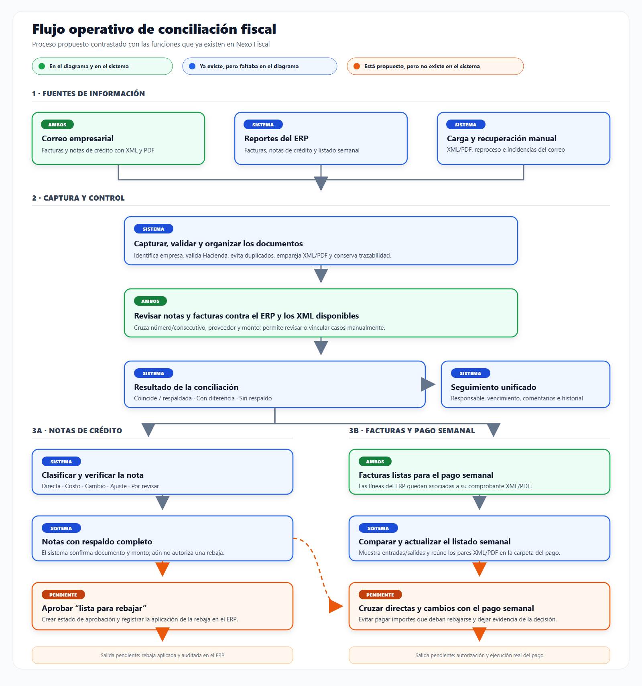

# Flujo operativo de conciliación fiscal

Este documento reorganiza el proceso original y lo contrasta con la implementación actual de Nexo Fiscal.

La versión [`SVG`](flujo-operativo-conciliacion.svg) conserva el texto y las formas editables.

## Cómo leer los colores

- **Verde — Ambos:** estaba en el diagrama original y ya está cubierto por el sistema.
- **Azul — Sistema:** el sistema ya lo hace, pero no aparecía en el diagrama original.
- **Naranja — Pendiente:** aparece o se desprende del proceso original, pero no está implementado como flujo funcional en el sistema.

## Conclusión funcional

El sistema ya cubre la captura documental, la conciliación y la preparación del expediente del pago semanal. La brecha principal empieza después de la conciliación: hoy una nota puede quedar con respaldo completo, pero no existe un estado formal **“lista para rebajar”**, una aprobación de esa rebaja ni su aplicación en el ERP.

También existen por separado la clasificación de notas directas/de cambio y el módulo de pago semanal, pero no hay un cruce funcional que descuente o bloquee automáticamente esas notas antes de autorizar el pago.

## Comparación punto por punto

| Elemento del proceso original | Situación en Nexo Fiscal | Resultado |
|---|---|---|
| Facturas y notas de todo el correo | Correo captura XML/PDF, distingue tipos, valida receptor/Hacienda y permite importación o descarte. | **Existe** |
| Revisión de notas y facturas contra el sistema | Facturas y notas se concilian contra datos del ERP y comprobantes XML; hay vínculo manual para excepciones. | **Existe** |
| Notas listas para rebajarse | El sistema identifica notas con respaldo, diferencias y faltantes, pero no tiene aprobación ni estado operativo de rebaja. | **Parcial** |
| Facturas listas para pagar | El listado semanal se cruza con facturas ERP y comprobantes; quedan respaldadas, con diferencia o sin respaldo. | **Existe** |
| Revisar notas directas/de cambio contra el pago semanal | Las notas se clasifican y el pago semanal se verifica, pero ambos flujos no se cruzan entre sí. | **No existe** |
| Pago semanal | Se prepara, compara, actualiza, exporta y organiza su expediente XML/PDF. El sistema no ejecuta el pago bancario/contable. | **Parcial** |

## Funciones existentes que faltaban en el diagrama

- Carga de reportes ERP y carga manual de comprobantes.
- Captura automática del correo, deduplicación y validación de Hacienda.
- Asociación de documentos a la empresa correspondiente.
- Semáforo de conciliación: coincide/respaldada, con diferencia y sin respaldo.
- Clasificación de notas: directa, costo, cambio, ajuste y por revisar.
- Vista previa y comparación de cambios antes de actualizar el pago semanal.
- Organización de los pares XML/PDF en la carpeta del pago.
- Cola unificada de seguimiento en cuatro estados (pendiente, en revisión, lista, cerrada), con responsable, recordatorio, comentarios e historial; cualquier documento se puede mover de estado a mano.

## Funciones que faltan para cerrar el proceso

1. Agregar estados de rebaja, por ejemplo: `candidata`, `aprobada`, `aplicada` y `rechazada`.
2. Registrar quién aprueba, cuándo y por qué se rebaja una nota.
3. Cruzar notas directas y de cambio con las facturas incluidas en el pago semanal.
4. Alertar o bloquear el pago cuando una rebaja aprobada todavía no se haya aplicado.
5. Registrar la referencia de la rebaja aplicada en el ERP.
6. Si se desea que Nexo Fiscal cierre todo el ciclo, integrar la autorización/ejecución del pago; actualmente el sistema solo prepara y verifica el expediente.

## Evidencia en el sistema

- Rutas de Correo, Pagos semanales, Facturas ERP, Notas de crédito y Seguimiento: [`app/config/routes.php`](../app/config/routes.php).
- Clasificación de notas directas, costo, cambio y ajuste: [`app/helpers/ClaseNotaCredito.php`](../app/helpers/ClaseNotaCredito.php).
- Verificación de notas contra XML y referencias: [`app/helpers/NotasCreditoVerificador.php`](../app/helpers/NotasCreditoVerificador.php).
- Verificación del pago semanal contra comprobantes: [`app/helpers/PorPagarVerificador.php`](../app/helpers/PorPagarVerificador.php).
- Cola conjunta de pendientes de notas de crédito y facturas del ERP con saldo: [`app/models/Seguimiento.php`](../app/models/Seguimiento.php).

> Recomendación de lenguaje: mientras no exista una aprobación formal, llamar a esas notas **“con respaldo completo”** o **“candidatas a rebaja”**. Reservar **“listas para rebajar”** para las que ya fueron aprobadas.
